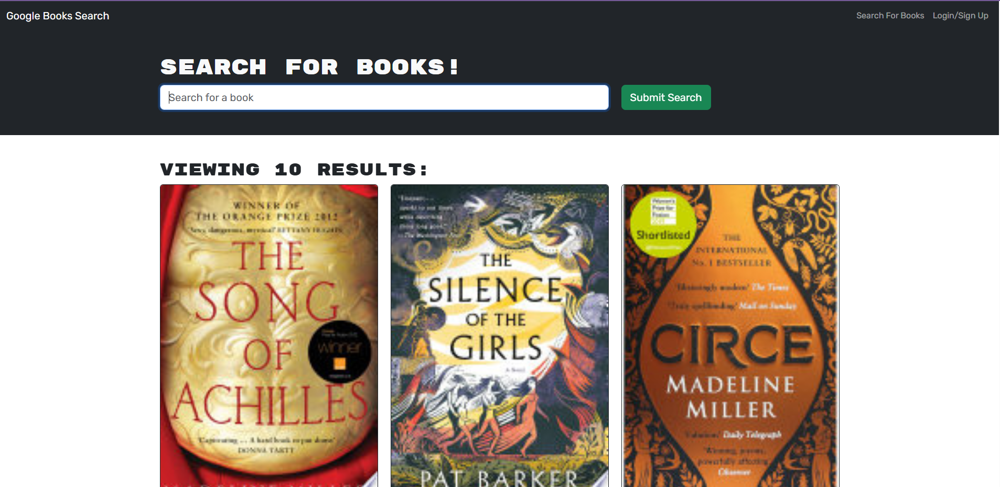

# NovelNexus
  

  ## Description 
Search for books using the power of Google Books, complete with summaries and cover images to help you choose your next read. Create your own profile to save your favorite books and build a personalized library you can revisit anytime.

 ## Table of Contents 
- [Installation](#installation) 
- [Usage](#usage)
- [License](#license)
- [Contributing](#contributing)
- [Tests](#tests)
- [Render Link](#render-link)
- [Questions](#questions)
- [Credits](#credits)
  
## Installation 
Want to try it for yourself? Skip this step and [click here!](https://novelnexus-d5zy.onrender.com)
If you want to run it locally, here’s what you need to do:
1. Clone or download the repo.
2. Install the required dependencies with ``npm install``
3. Create a ``.env`` file and set up environment variables.
4. Run ``npm run build`` to build the app
5. Run ``npm run develop`` to start it
6. That’s it! Your app is ready to go — explore and enjoy!

## Usage 
Once the app is running—either through the live link or your local setup—simply type in the name of a book and hit **Submit** to see it populate with details like a summary and cover image.

Ready to build your personal library? Click **Sign Up** to create an account. Once logged in, search for a book and click **Save this Book!** to add it to your collection. Head over to the **See Your Books** tab to view all your saved favorites.

## License
This project is licensed under the MIT license.

[Learn more about this license](https://opensource.org/licenses/MIT)

  ## Contributing
  This project is completely open to any modifications that would help aid in the smoothness of the process. If you'd like to, let's chat! Email me with your contact information and github username, resources to contact me are listed below.

  ## Tests
  If you’d like to explore the app without creating an account, use the test login below:

  **Email:** test@test.com
  
  **Password:** test

Then, simply follow the usage steps above to try out the features!

  ## Render Link
  To visit the deployed site, just [click here!](https://novelnexus-d5zy.onrender.com)   

  ## Questions
  If you have any questions, feel free to contact me at [hannahbry05@gmail.com](mailto:hannahbry05@gmail.com).
  
  You can also explore more of my work on GitHub here: [hanhasbeenbanned](https://github.com/hanhasbeenbanned).

  ## Credits 
  NovelNexus was created with the support from fellow classmates, ChatGPT, and class instruction.
  
